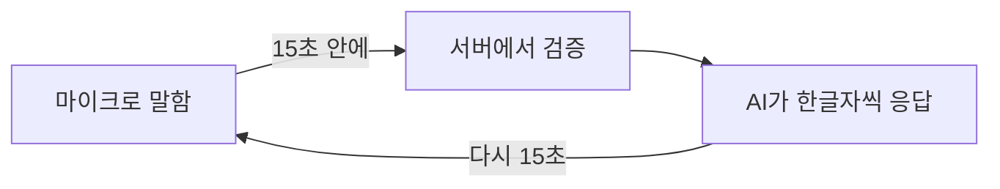
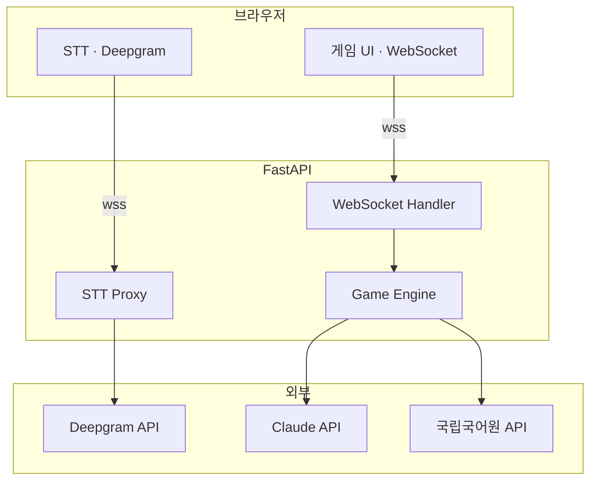
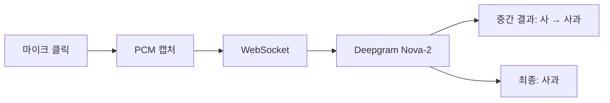
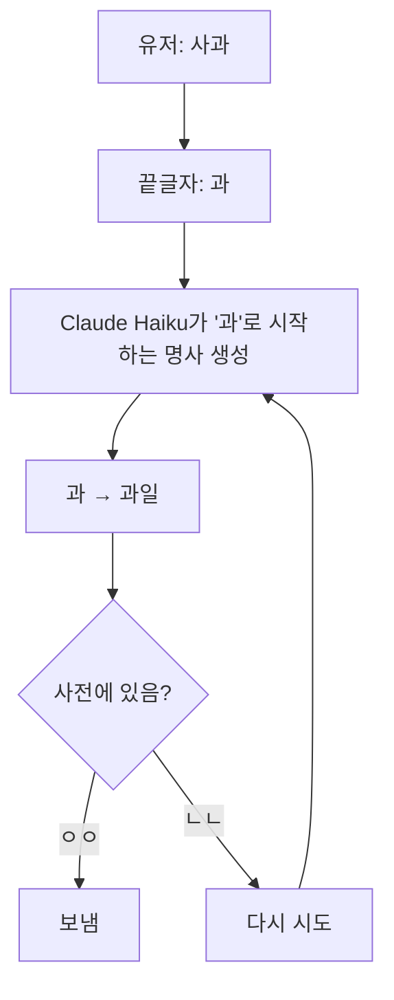
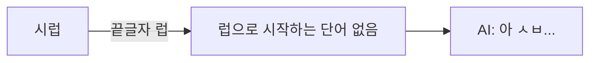
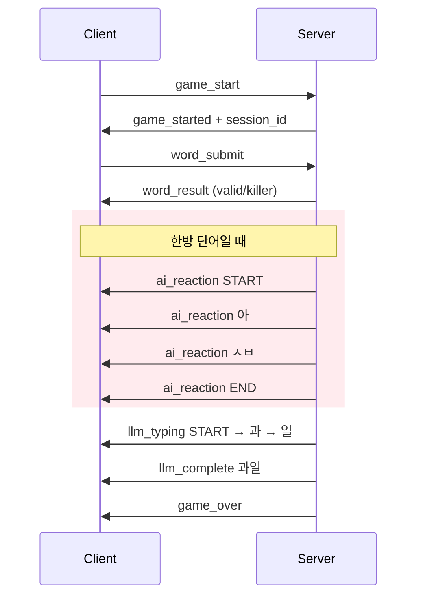
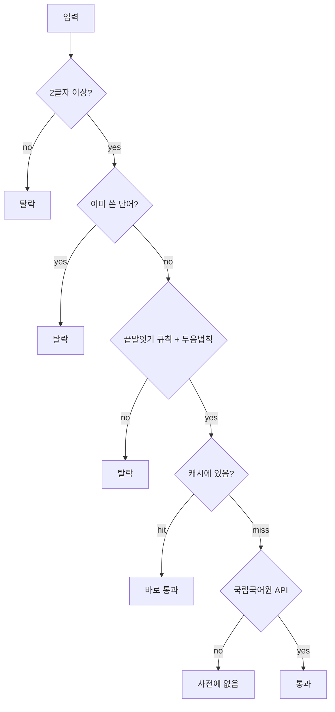

<div align="center">

# 끝말잇기 vs AI

음성으로 AI한테 끝말잇기 걸 수 있음

`"사과" → "과일" → "일출" → ...`

Claude Haiku · Deepgram STT · 국립국어원 사전 · FastAPI WebSocket

<br>

### [▶ 플레이](https://web-production-8d608.up.railway.app/)

[](https://railway.com)

---

</div>

## 어떻게 돌아가냐면



- 한방 단어 쓰면 AI가 욕함 (LLM이 실시간 생성)
- 15초 넘기면 짐

## 구조



## 음성 인식



## AI 응답



## 한방 단어

럽, 릎, 듐, 륨, 늄, 늅, 뀨, 쀼, 튐

이 글자로 끝나는 단어 쓰면 AI가 이을 수가 없음 → 짜증 리액션 나옴



## WebSocket 프로토콜



## 단어 검증



## 두음법칙

| 원래 | 변환 |
|:----:|:----:|
| 녀 | 여 |
| 뇨 | 요 |
| 뉴 | 유 |
| 니 | 이 |
| 라 | 나 |
| 려 | 여 |
| 례 | 예 |
| 료 | 요 |
| 류 | 유 |
| 리 | 이 |

예: "여료" → 료로 끝남 → "요리" (료→요) OK

## 파일 구조

```
word-chain-game/
├── Procfile                    # Railway 배포
├── requirements.txt            # Python 의존성
├── backend/
│   ├── main.py                 # FastAPI 진입점
│   ├── game/
│   │   ├── engine.py           # 게임 엔진
│   │   ├── state.py            # 상태 관리
│   │   └── rules.py            # 규칙 검증
│   ├── llm/
│   │   ├── service.py          # Claude 스트리밍
│   │   └── prompt_builder.py   # 프롬프트
│   ├── dictionary/
│   │   ├── validator.py        # 단어 검증
│   │   ├── korean_api_client.py # 국립국어원 API
│   │   └── cache.py            # LRU 캐시
│   ├── websocket/
│   │   ├── handlers.py         # 메시지 라우팅
│   │   ├── manager.py          # 연결 관리
│   │   └── messages.py         # 메시지 스키마
│   ├── stt/
│   │   └── deepgram_proxy.py   # Deepgram 프록시
│   └── utils/
│       ├── korean.py           # 한글 처리
│       └── config.py           # 환경 변수
└── dist/
    └── index.html              # 프론트엔드 번들
```

## 기술 스택

| 구분 | 사용 |
|------|------|
| Frontend | Vanilla JS, Web Audio API, WebSocket, CSS Animations |
| Backend | FastAPI, Uvicorn, Pydantic, aiohttp |
| AI | Claude Haiku (Anthropic) |
| STT | Deepgram Nova-2 |
| 사전 | 국립국어원 한국어기초사전 API |

## 실행

```bash
pip install -r requirements.txt
cp backend/.env.example .env   # API 키 넣기
uvicorn backend.main:app --host 0.0.0.0 --port 8000
```

http://localhost:8000 접속

### 환경 변수

| 변수 | 필수 | 용도 |
|------|:----:|------|
| `ANTHROPIC_API_KEY` | O | Claude API |
| `KOREAN_DICT_API_KEY` | O | 국립국어원 API |
| `DEEPGRAM_API_KEY` | O | Deepgram STT |
| `ANTHROPIC_BASE_URL` | | 프록시 쓸 때 |

## 규칙

1. 상대 단어 끝글자로 시작하는 2글자 이상 명사
2. 국립국어원 사전에 있는 단어만
3. 한번 쓴 단어 다시 못 씀
4. 두음법칙 적용됨
5. 15초 안에 못 대면 짐
6. AI도 같은 규칙
