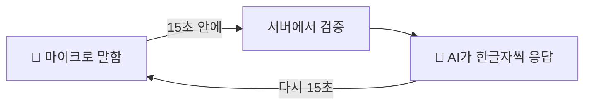
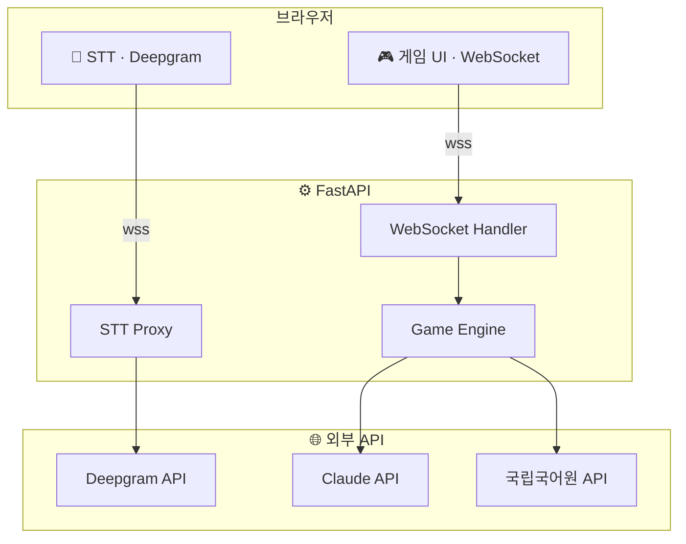
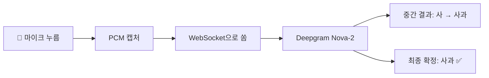
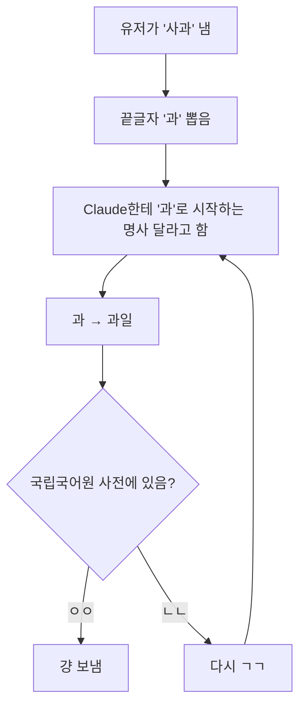
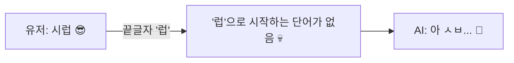
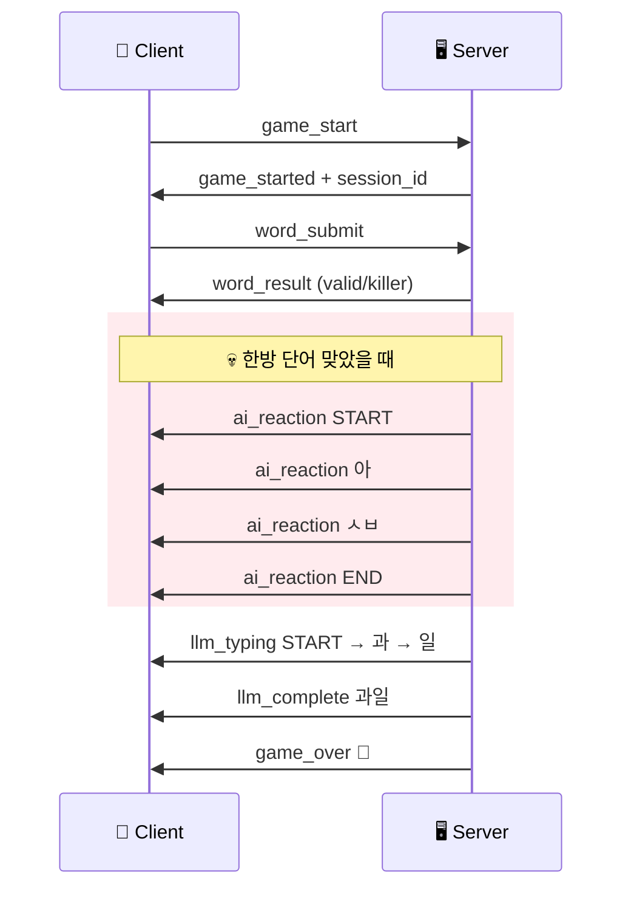
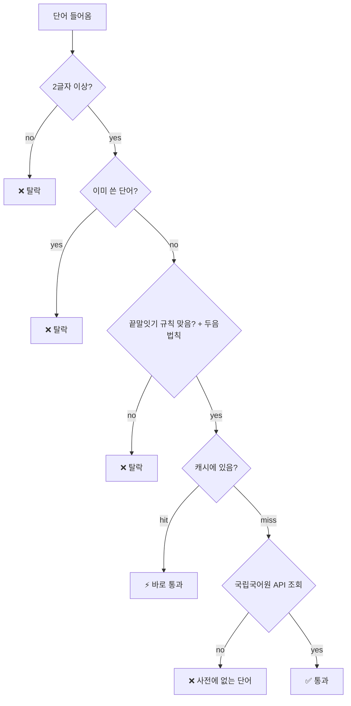

<div align="center">

# 🎤 끝말잇기 vs AI 🤖

마이크 키고 AI한테 끝말잇기 걸 수 있는 웹게임임

`"사과" → "과일" → "일출" → ...`

Claude Haiku · Deepgram STT · 국립국어원 사전 · FastAPI WebSocket

<br>

### [🕹️ 바로 하기](https://web-production-8d608.up.railway.app/)

[](https://railway.com)

---

</div>

## 🔄 대충 이렇게 돌아감



- 한방 단어 쓰면 AI가 욕함 🤬 (LLM이 실시간으로 생성해서 뱉음)
- 15초 넘기면 그냥 짐

## 🏗️ 전체 구조



## 🎤 음성 인식 흐름



## 🤖 AI는 이렇게 대답함



## 💀 한방 단어

> **럽, 릎, 듐, 륨, 늄, 늅, 뀨, 쀼, 튐**

이 글자로 끝나는 단어 던지면 AI가 이을 수가 없어서 짜증냄 ㅋㅋ



## 📡 WebSocket 주고받는 거



## ✅ 단어 검증 과정



## 📝 두음법칙

| 원래 | → | 바뀜 |
|:----:|:-:|:----:|
| 녀 | → | 여 |
| 뇨 | → | 요 |
| 뉴 | → | 유 |
| 니 | → | 이 |
| 라 | → | 나 |
| 려 | → | 여 |
| 례 | → | 예 |
| 료 | → | 요 |
| 류 | → | 유 |
| 리 | → | 이 |

예: "여료" → 끝이 '료' → "요리" (료→요 변환) 이것도 인정해줌 👍

## 📂 파일 구조

```
word-chain-game/
├── Procfile                    # Railway 배포용
├── requirements.txt            # 파이썬 패키지
├── backend/
│   ├── main.py                 # FastAPI 앱
│   ├── game/
│   │   ├── engine.py           # 게임 엔진
│   │   ├── state.py            # 상태 관리
│   │   └── rules.py            # 규칙 검증
│   ├── llm/
│   │   ├── service.py          # Claude 스트리밍
│   │   └── prompt_builder.py   # 프롬프트
│   ├── dictionary/
│   │   ├── validator.py        # 단어 검증
│   │   ├── korean_api_client.py # 국립국어원 API
│   │   └── cache.py            # LRU 캐시
│   ├── websocket/
│   │   ├── handlers.py         # 메시지 라우팅
│   │   ├── manager.py          # 연결 관리
│   │   └── messages.py         # 메시지 스키마
│   ├── stt/
│   │   └── deepgram_proxy.py   # Deepgram 프록시
│   └── utils/
│       ├── korean.py           # 한글 유틸
│       └── config.py           # 환경 변수
└── dist/
    └── index.html              # 프론트엔드 (싱글 파일 번들)
```

## 🛠️ 기술 스택

| 뭐 | 뭘로 |
|------|------|
| 프론트 | Vanilla JS, Web Audio API, WebSocket, CSS 애니메이션 |
| 백엔드 | FastAPI, Uvicorn, Pydantic, aiohttp |
| AI | Claude Haiku (Anthropic) |
| 음성인식 | Deepgram Nova-2 |
| 사전 | 국립국어원 한국어기초사전 API |

## 🚀 로컬에서 돌리기

```bash
pip install -r requirements.txt
cp backend/.env.example .env   # 여기에 API 키 넣으면 됨
uvicorn backend.main:app --host 0.0.0.0 --port 8000
```

http://localhost:8000 들어가면 됨

### 환경 변수

| 변수 | 필수 | 뭐하는거 |
|------|:----:|------|
| `ANTHROPIC_API_KEY` | ⭕ | Claude API 키 |
| `KOREAN_DICT_API_KEY` | ⭕ | 국립국어원 API 키 |
| `DEEPGRAM_API_KEY` | ⭕ | Deepgram STT 키 |
| `ANTHROPIC_BASE_URL` | | 프록시 쓸 때만 |

## 📜 게임 규칙

1. 상대 단어 끝글자로 시작하는 **2글자 이상** 명사 말하기
2. 국립국어원 사전에 등록된 단어만 인정
3. 한번 나온 단어는 다시 못 씀
4. 두음법칙 적용됨 (려→여, 류→유 이런거)
5. 15초 안에 못 대면 짐 💀
6. AI도 똑같은 규칙 적용됨 (봐주는 거 없음)
