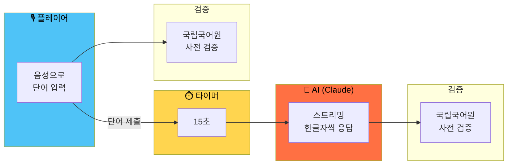
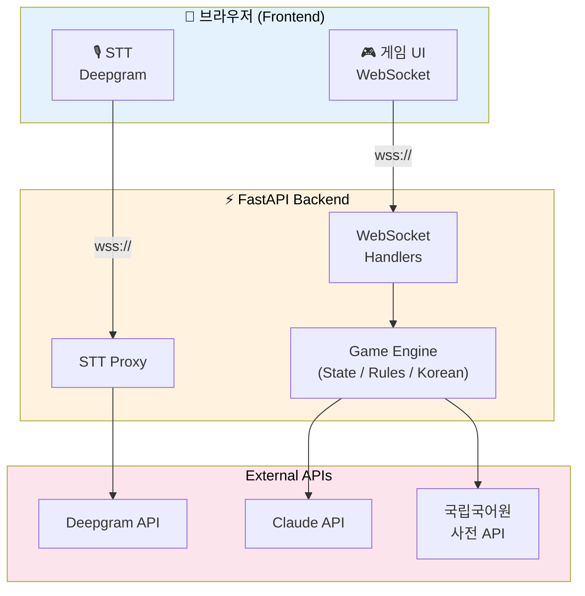
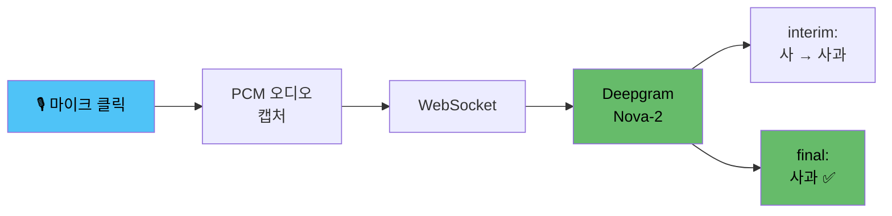
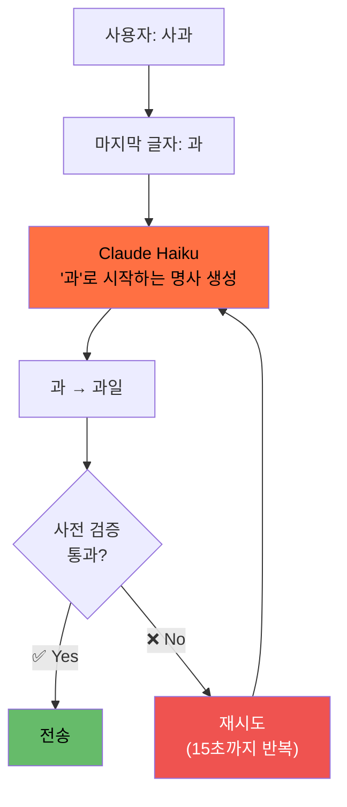
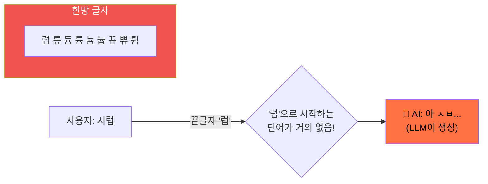
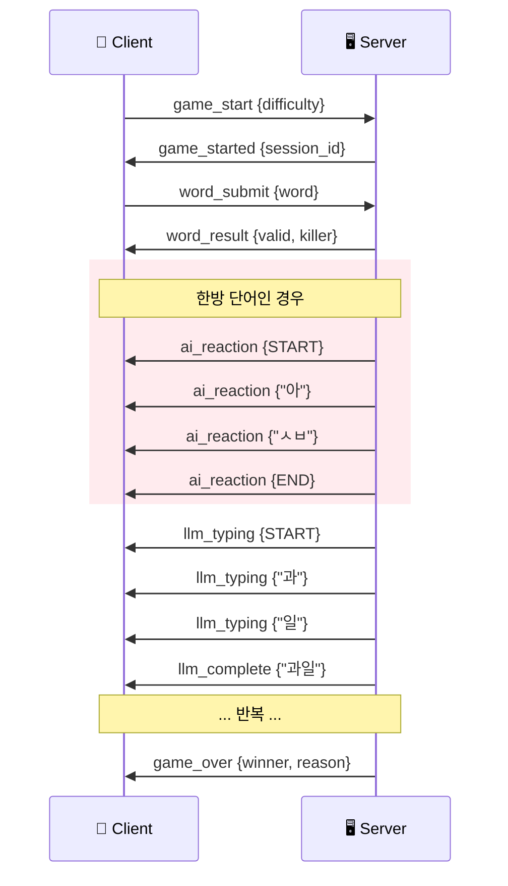
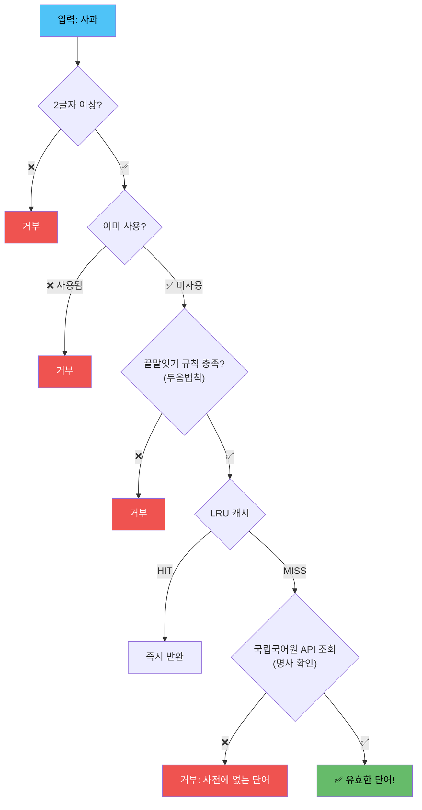
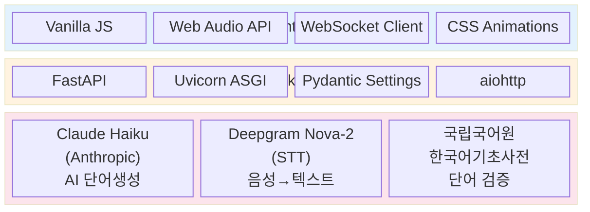

<div align="center">

# 끝말잇기 vs AI

### 음성으로 AI와 대결하는 한국어 끝말잇기

<br>

🎙️ **"사과"** → 🤖 **"과일"** → 🎙️ **"일출"** → **...**

**Claude Haiku** | **Deepgram STT** | **국립국어원 사전** | **FastAPI WebSocket**

<br>

### [🎮 지금 플레이하기](https://web-production-8d608.up.railway.app/)

[](https://railway.com)

---

</div>

<br>

## 게임 흐름



> 💀 **한방 단어** 사용 시 → AI가 짜증 리액션 생성!
> ⏰ **15초** 초과 시 → 패배

<br>

## 시스템 아키텍처



<br>

## 핵심 기능

### 🎙️ 음성 입력 (STT)



### 🤖 AI 응답 (스트리밍)



### 💀 한방 단어 시스템



<br>

## 메시지 프로토콜 (WebSocket)



<br>

## 단어 검증 파이프라인



<br>

## 두음법칙 처리

| 원래 글자 | 허용되는 시작 글자 |
|:---------:|:-----------------:|
| 녀 | 여 |
| 뇨 | 요 |
| 뉴 | 유 |
| 니 | 이 |
| 라 | 나 |
| 려 | 여 |
| 례 | 예 |
| 료 | 요 |
| 류 | 유 |
| 리 | 이 |

> **예시:** "여료" → '료'로 끝남 → "요리" (료→요) 허용! ✅

<br>

## 프로젝트 구조

```
word-chain-game/
│
├── 📄 Procfile                 ← Railway 배포 설정
├── 📄 requirements.txt         ← Python 의존성
│
├── 📁 backend/
│   ├── 🚀 main.py              ← FastAPI 앱 진입점
│   │
│   ├── 📁 game/                 ← 게임 로직
│   │   ├── engine.py            ← 게임 엔진 (턴 관리, AI 응답)
│   │   ├── state.py             ← 게임 상태 (Pydantic 모델)
│   │   └── rules.py             ← 게임 규칙 검증
│   │
│   ├── 📁 llm/                  ← AI 연동
│   │   ├── service.py           ← Claude API 스트리밍
│   │   └── prompt_builder.py    ← 프롬프트 생성기
│   │
│   ├── 📁 dictionary/           ← 사전 검증
│   │   ├── validator.py         ← 단어 유효성 검사
│   │   ├── korean_api_client.py ← 국립국어원 API
│   │   └── cache.py             ← LRU 캐시
│   │
│   ├── 📁 websocket/            ← 실시간 통신
│   │   ├── handlers.py          ← 메시지 라우터
│   │   ├── manager.py           ← 연결 관리자
│   │   └── messages.py          ← 메시지 스키마
│   │
│   ├── 📁 stt/                  ← 음성 인식
│   │   └── deepgram_proxy.py    ← Deepgram WebSocket 프록시
│   │
│   └── 📁 utils/                ← 유틸리티
│       ├── korean.py            ← 한글 처리 (두음법칙, 한방글자)
│       └── config.py            ← 환경 변수 설정
│
└── 📁 dist/
    └── index.html               ← 프론트엔드 번들 (단일 파일)
```

<br>

## 기술 스택



<br>

## 배포

### Railway (권장)

```bash
# 1. GitHub 리포 연결 후 환경 변수 설정
ANTHROPIC_API_KEY=sk-...
ANTHROPIC_BASE_URL=              # 선택사항 (프록시 사용 시)
DEEPGRAM_API_KEY=...
KOREAN_DICT_API_KEY=...
```

### 로컬 실행

```bash
# 1. 의존성 설치
pip install -r requirements.txt

# 2. 환경 변수 설정
cp backend/.env.example .env
# .env 파일에 API 키 입력

# 3. 서버 실행
uvicorn backend.main:app --host 0.0.0.0 --port 8000

# 4. 브라우저에서 접속
# http://localhost:8000
```

### 환경 변수

| 변수 | 필수 | 설명 |
|------|:----:|------|
| `ANTHROPIC_API_KEY` | ✅ | Claude API 키 |
| `KOREAN_DICT_API_KEY` | ✅ | 국립국어원 API 키 |
| `DEEPGRAM_API_KEY` | ✅ | Deepgram STT API 키 |
| `ANTHROPIC_BASE_URL` | | API 프록시 URL (선택) |

<br>

## 게임 규칙

1. 상대방 단어의 마지막 글자로 시작하는 **2글자 이상**의 한국어 명사를 말한다
2. **국립국어원 사전**에 등재된 단어만 인정
3. 이미 사용한 단어는 **재사용 불가**
4. **두음법칙** 적용 (려→여, 류→유 등)
5. **15초** 안에 답하지 못하면 패배
6. AI도 동일한 규칙 적용 — 15초 타임아웃

<br>

---

<div align="center">

Built with **Claude Haiku** + **FastAPI** + **Deepgram**

</div>
