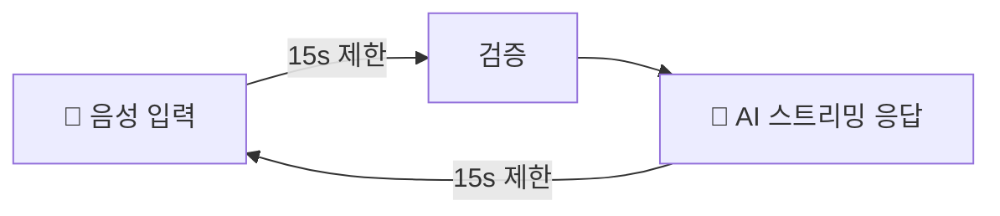
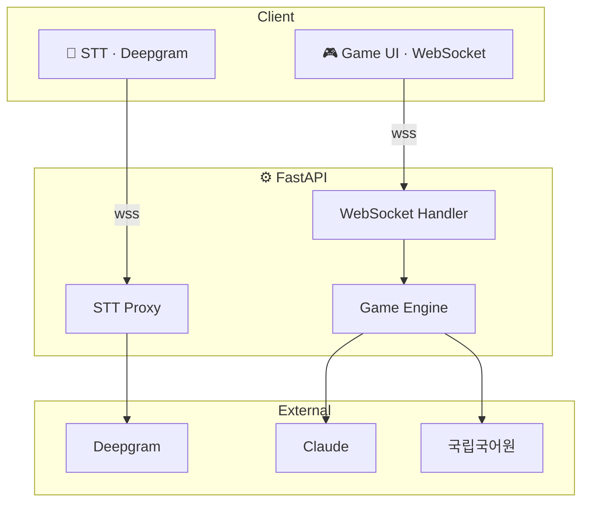
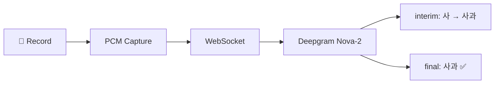
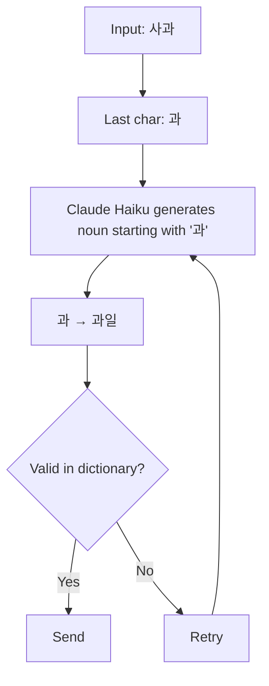
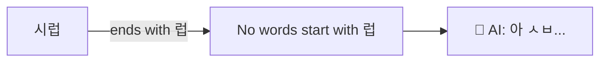
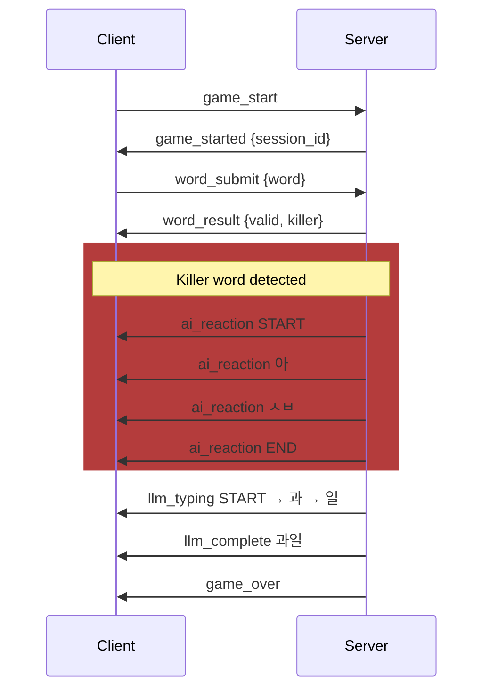
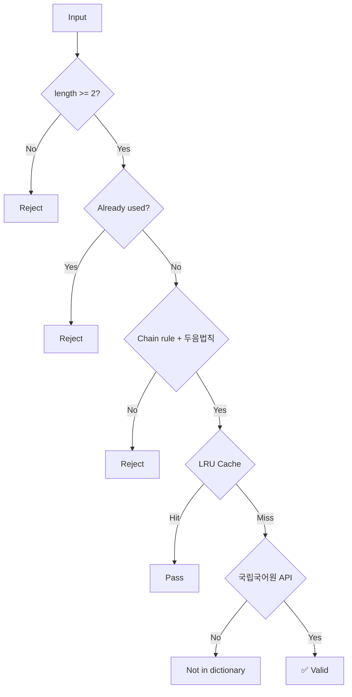

<div align="center">

# 끝말잇기 vs AI

음성 기반 실시간 끝말잇기 대전

`사과 → 과일 → 일출 → ...`

<br>

    

<br>

[](https://web-production-8d608.up.railway.app/) [](https://railway.com)

---

</div>

## Game Flow



- 한방 단어 → AI 리액션 (LLM 실시간 생성)
- 타임아웃 → 패배

## Architecture



## STT Pipeline



## AI Response



## 💀 Killer Words

> `럽 릎 듐 륨 늄 늅 뀨 쀼 튐`

이 글자로 끝나는 단어를 사용하면 AI가 이을 수 없음 → LLM이 짜증 리액션 생성



## WebSocket Protocol



## Word Validation



## 두음법칙 (Initial Sound Rule)

| Original | Allowed |
|:--------:|:-------:|
| 녀 → 여 | 뇨 → 요 |
| 뉴 → 유 | 니 → 이 |
| 라 → 나 | 려 → 여 |
| 례 → 예 | 료 → 요 |
| 류 → 유 | 리 → 이 |

`여료 → ends with 료 → 요리 (료→요) accepted`

## Project Structure

```
word-chain-game/
├── Procfile
├── requirements.txt
├── backend/
│   ├── main.py
│   ├── game/
│   │   ├── engine.py
│   │   ├── state.py
│   │   └── rules.py
│   ├── llm/
│   │   ├── service.py
│   │   └── prompt_builder.py
│   ├── dictionary/
│   │   ├── validator.py
│   │   ├── korean_api_client.py
│   │   └── cache.py
│   ├── websocket/
│   │   ├── handlers.py
│   │   ├── manager.py
│   │   └── messages.py
│   ├── stt/
│   │   └── deepgram_proxy.py
│   └── utils/
│       ├── korean.py
│       └── config.py
└── dist/
    └── index.html
```

## Stack

| Layer | Tech | Logo |
|-------|------|-|
| Frontend | Vanilla JS, Web Audio, WebSocket |   |
| Backend | FastAPI, Uvicorn, Pydantic |   |
| AI | Claude Haiku |  |
| STT | Deepgram Nova-2 |  |
| Dictionary | 국립국어원 API |  |
| Deploy | Railway |  |

## Setup

```bash
pip install -r requirements.txt
cp backend/.env.example .env
uvicorn backend.main:app --host 0.0.0.0 --port 8000
```

| Env | Required | Description |
|-----|:--------:|-------------|
| `ANTHROPIC_API_KEY` | ✓ |  |
| `KOREAN_DICT_API_KEY` | ✓ |  |
| `DEEPGRAM_API_KEY` | ✓ |  |
| `ANTHROPIC_BASE_URL` | | Proxy URL |

## Rules

1. 상대 단어의 마지막 글자로 시작하는 2글자 이상의 명사
2. 국립국어원 사전 등재 단어만 유효
3. 중복 사용 불가
4. 두음법칙 허용
5. 제한시간 15초
6. AI 동일 규칙 적용
